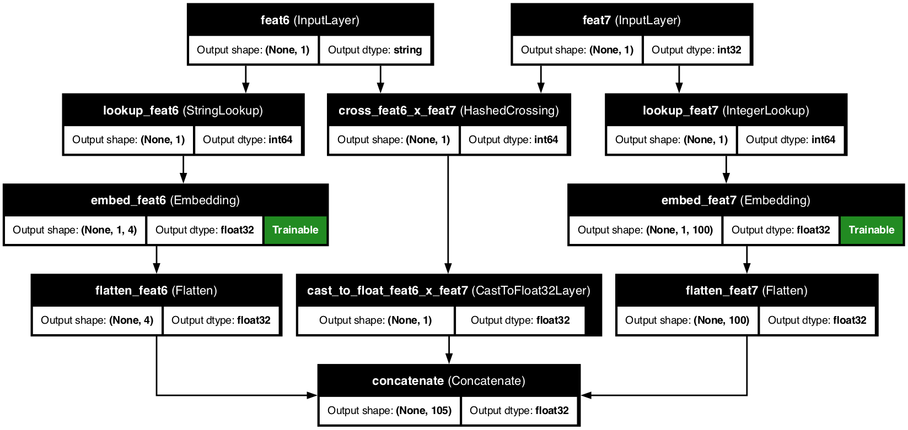

# Defining Features for Preprocessing 🌟

Customize the preprocessing pipeline by setting up a dictionary that maps feature names to their respective types, tailored to your specific requirements.

## 💯 Numeric Features

Explore various methods to define numerical features tailored to your needs:

=== "ℹ️ Simple Declaration"

    ```python
    features_specs = {
        "feat1": "float",
        "feat2": "FLOAT",
        "feat3": "FLOAT_NORMALIZED",
        "feat3": "FLOAT_RESCALED",
        ...
    }
    ```

=== "🔧 Using FeatureType"

    Utilize predefined preprocessing configurations with `FeatureType`.

    ```python
    from kdp.features import FeatureType

    features_specs = {
        "feat1": FeatureType.FLOAT_NORMALIZED,
        "feat2": FeatureType.FLOAT_RESCALED,
        ...
    }
    ```

    Available `FeatureType` options:

    - FLOAT
    - FLOAT_NORMALIZED
    - FLOAT_RESCALED
    - FLOAT_DISCRETIZED

=== "💪 Custom NumericalFeature"

    Customize preprocessing by passing specific parameters to `NumericalFeature`.

    ```python
    from kdp.features import NumericalFeature

    features_specs = {
        "feat3": NumericalFeature(
            name="feat3",
            feature_type=FeatureType.FLOAT_DISCRETIZED,
            bin_boundaries=[(1, 10)],
        ),
        "feat4": NumericalFeature(
            name="feat4",
            feature_type=FeatureType.FLOAT,
        ),
        ...
    }
    ```

Here's how the numeric preprocessing pipeline looks:


## 🐈‍⬛ Categorical Features

Define categorical features flexibly:

=== "ℹ️ Simple Declaration"

    ```python
    features_specs = {
        "feat1": "INTEGER_CATEGORICAL",
        "feat2": "STRING_CATEGORICAL",
        "feat3": "string_categorical",
        ...
    }
    ```

=== "🔧 Using FeatureType"

    Leverage default configurations with `FeatureType`.

    ```python
    from kdp.features import FeatureType

    features_specs = {
        "feat1": FeatureType.INTEGER_CATEGORICAL,
        "feat2": FeatureType.STRING_CATEGORICAL,
        ...
    }
    ```

    Available `FeatureType` options:

    - STRING_CATEGORICAL
    - INTEGER_CATEGORICAL

=== "💪 Custom CategoricalFeature"

    Tailor feature processing by specifying properties in `CategoricalFeature`.

    ```python
    from kdp.features
    from kdp.features import CategoricalFeature

    features_specs = {
        "feat1": CategoricalFeature(
            name="feat7",
            feature_type=FeatureType.INTEGER_CATEGORICAL,
            embedding_size=100,
        ),
        "feat2": CategoricalFeature(
            name="feat2",
            feature_type=FeatureType.STRING_CATEGORICAL,
        ),
        ...
    }
    ```

See how the categorical preprocessing pipeline appears:


## 📝 Text Features

Customize text features in multiple ways to fit your project's demands:

=== "ℹ️ Simple Declaration"

    ```python
    features_specs = {
        "feat1": "text",
        "feat2": "TEXT",
        ...
    }
    ```

=== "🔧 Using FeatureType"

    Use `FeatureType` for automatic default preprocessing setups.

    ```python
    from kdp.features import FeatureType

    features_specs = {
        "feat1": FeatureType.TEXT,
        "feat2": FeatureType.TEXT,
        ...
    }
    ```

    Available `FeatureType` options:

    - TEXT

=== "💪 Custom TextFeature"

    Customize text preprocessing by passing specific arguments to `TextFeature`.

    ```python
    from kdp.features import TextFeature

    features_specs = {
        "feat1": TextFeature(
            name="feat2",
            feature_type=FeatureType.TEXT,
            max_tokens=100,
            stop_words=["stop", "next"],
        ),
        "feat2": TextFeature(
            name="feat2",
            feature_type=FeatureType.TEXT,
        ),
        ...
    }
    ```

Here's how the text feature preprocessing pipeline looks:


## ❌ Cross Features

To implement cross features, specify a list of feature tuples in the `PreprocessingModel` like so:

```python
from kdp.processor import PreprocessingModel

ppr = PreprocessingModel(
    path_data="data/data.csv",
    features_specs={
        "feat6": FeatureType.STRING_CATEGORICAL,
        "feat7": FeatureType.INTEGER_CATEGORICAL,
    },
    feature_crosses=[("feat6", "feat7", 5)],
)
```

Example cross feature between INTEGER_CATEGORICAL and STRING_CATEGORICAL:



## 📆 Date Features

You can even process string encoded date features (format: 'YYYY-MM-DD'):

=== "🔧 Using FeatureType"

    Use `FeatureType` for automatic default preprocessing setups.

    ```python
    from kdp.processor import PreprocessingModel

    ppr = PreprocessingModel(
        path_data="data/data.csv",
        features_specs={
            "feat1": FeatureType.FLOAT,
            "feat2": FeatureType.DATE,
        },
    )
    ```

=== "💪 Custom DateFeature"

    Customize text preprocessing by passing specific arguments to `TextFeature`.

    ```python
    from kdp.features import DateFeature

    features_specs = {
        "feat1": DateFeature(
            name="feat2",
            feature_type=FeatureType.FLOAT,
        ),
        "feat2": TextFeature(
            name="feat2",
            feature_type=FeatureType.DATE,
            # additional option to add season layer:
            add_season=True,  # adds one-hot season indicator (summer, winter, etc) defaults to False
        ),
        ...
    }
    ```

Example date and numeric processing pipeline:


## 🚀 Custom Preprocessing Steps

If you require even more customization, you can define custom preprocessing steps using the `Feature` class, using `preprocessors` attribute.


The `preprocessors` attribute accepts a list of methods defined in `PreprocessorLayerFactory`.

```python
from kdp.features import Feature

features_specs = {
    "feat1": FeatureType.FLOAT_NORMALIZED,
    "feat2": Feature(
        name="custom_feature_pipeline",
        feature_type=FeatureType.FLOAT_NORMALIZED,
        preprocessors=[
            tf.keras.layers.Rescaling,
            tf.keras.layers.Normalization,

        ],
        # leyers required kwargs
        scale=1,
    )
}
```

Here's how the text feature preprocessing pipeline looks:


The full list of available layers can be found: [Preprocessing Layers Factory](layers_factory.md)
