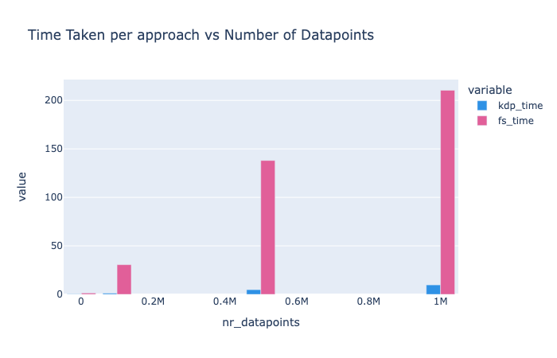

# 🍦 The Motivation Behind Keras Data Processor

**The burning question now is ❓:**

> Why create a new preprocessing pipeline or model when we already have an excellent tool like [Keras FeatureSpace](https://www.tensorflow.org/api_docs/python/tf/keras/utils/FeatureSpace)?

While `Keras FeatureSpace` has been a cornerstone in many of my projects, delivering great results, I encountered significant challenges in a high-volume data project. The tool required multiple data passes (proportional to the number of features), executing `.adapt` for each feature. This led to exceedingly long preprocessing times and frequent out-of-memory errors.

This experience motivated a deep dive into the internal workings of Keras FeatureSpace and thus, motivated me to develop a new preprocessing pipeline that could handle data more efficiently—both in terms of speed and memory usage. Thus, the journey began to craft a solution that would:

- [x] Process data in a single pass, utilizing an iterative approach to avoid loading the entire dataset into memory, managed by a batch_size parameter.

- [x] Introduce custom predefined preprocessing steps tailored to the feature type, controlled by a feature_type parameter.

- [x] Offer greater flexibility for custom preprocessing steps and a more Pythonic internal implementation.

- [x] Align closely with the API of Keras FeatureSpace (proposing something similar), with the hope that it might eventually be integrated into the KFS ecosystem.

## Quick Benchmark Overview

To demonstrate the effectiveness of our new preprocessing pipeline, we conducted a benchmark comparing it with the traditional Keras FeatureSpace (this will give you a glimps on what was described earlier for the big data cases). Here’s how we did it:

??? info "Benchmarking Steps:"

    - **Setup**: We configure the benchmark by specifying a set number of features in a loop. Each feature's specification (either a normalized float or a categorical string) is defined in a dictionary.

    - **Data Generation**: For each set number of data points determined in another loop, we generate mock data based on the feature specifications and data points, which is then saved to a CSV file.

    - **Memory Management**: We use garbage collection to free up memory before and after each benchmarking run, coupled with a 10-second cooldown period to ensure all operations complete fully.

    - **Performance Measurement**: For both the Keras Data Processor (KDP) and Keras Feature Space (FS), we measure and record CPU and memory usage before and after their respective functions run, noting the time taken.

    - **Results Compilation**: We collect and log results including the number of features, data points, execution time, memory, and CPU usage for each function in a structured format.

The results clearly illustrate the benefits, especially as the complexity of the data increases:

> The graph shows a steep rise in processing time with an increase in data points for both `KDP` and `FS`. However, KDP consistently outperforms `FS`, with the gap widening as the number of data points grows.

> This graph depicts the processing time increase with more features. Again, `KDP` outpaces `FS`, demonstrating substantial efficiency improvements.

The combined effect of both the number of features and data points leads to significant performance gains on the `KDP` sice and time and memory hungry `FS` for the bigger and more complex datasets. This project was born from the **need for better efficiency**, and it’s my **hope to continue refining this tool with community support**, pushing the boundaries of what we can achieve in data preprocessing (and maybe one day integrating it directly into Keras ❤️)!

There is much to be done and many features to be added, but I am excited to see where this journey takes us. Let’s build something great together! 🚀🔧
